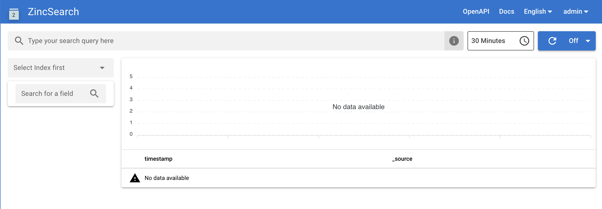

# Deploy SeaSearch

This document provides step by step guild for deploying SeaSearch using Docker.

## Getting started

The following assumptions and conventions are used in the rest of this document:

* `/opt/seasearch` is the directory for storing SeaSearch docker compose files. If you decide to put SeaSearch in a different directory, adjust all paths accordingly.
* `/opt/seasearch-data` is the directory for storing persisting data of SeaSearch.


## Download the yml and env file

You can download the `.yml` and `.env` files by following commands:

```bash
mkdir /opt/seasearch
cd /opt/seasearch
wget https://haiwen.github.io/seasearch-docs/repo/caddy.yml
wget https://haiwen.github.io/seasearch-docs/repo/seasearch.yml
wget -O .env https://haiwen.github.io/seasearch-docs/repo/env
```

## Modify .env file

Modify the environment variables ​​of the following fields in the `.env` file.

```shell
SEASEARCH_SERVER_HOSTNAME=seasearch.example.com

#SEASEARCH_IMAGE=seafileltd/seasearch-nomkl:latest # for Apple's chips
SEASEARCH_IMAGE=seafileltd/seasearch:latest

SS_DATA_PATH=/opt/seasearch-data
INIT_SS_ADMIN_USER=<admin-username>  
INIT_SS_ADMIN_PASSWORD=<admin-password>
```

!!! warning "For Apple's Chips"
    Since Apple's chips (such as M2) do not support [MKL](https://www.intel.com/content/www/us/en/developer/tools/oneapi/onemkl.html), you need to set the relevant image to `seafileltd/seasearch-nomkl:latest` if you use an Apple's chip:

    ```sh
    SEASEARCH_IMAGE=seafileltd/seasearch-nomkl:latest
    ```

## Start the service

Start the service use the following command:

```shell
docker-compose up -d
```

Now, you can access SeaSearch services at `http://seasearch.example.com/` and login by the `INIT_SS_ADMIN_USER` and `INIT_SS_ADMIN_PASSWORD` defined in the `.env` file. You will see the SeaSearch plane like below:




You can remove the initial admin account informations in `.env` (e.g., `INIT_SS_ADMIN_USER`, `INIT_SS_ADMIN_PASSWORD`), which are only used in the SeaSearch initialization progress. (Make sure **you have recorded it somewhere else in case you forget the password**.)
